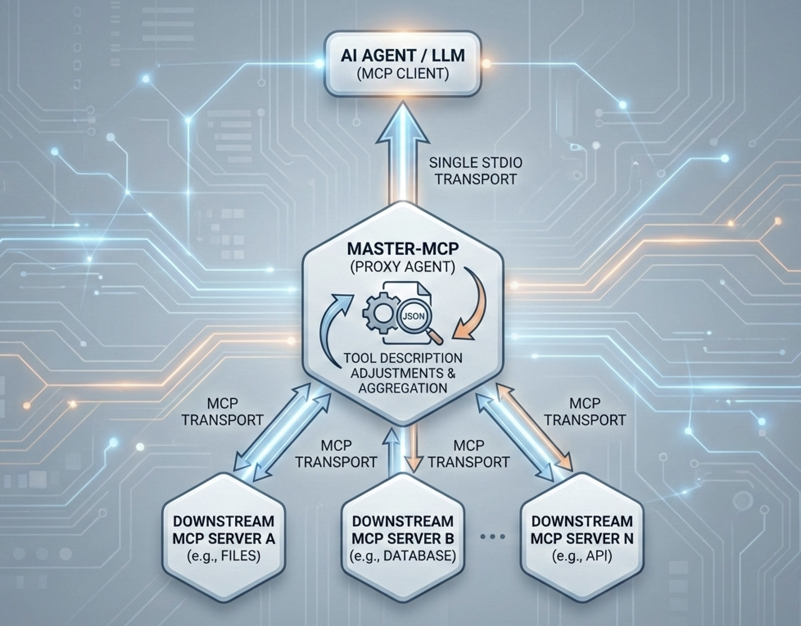
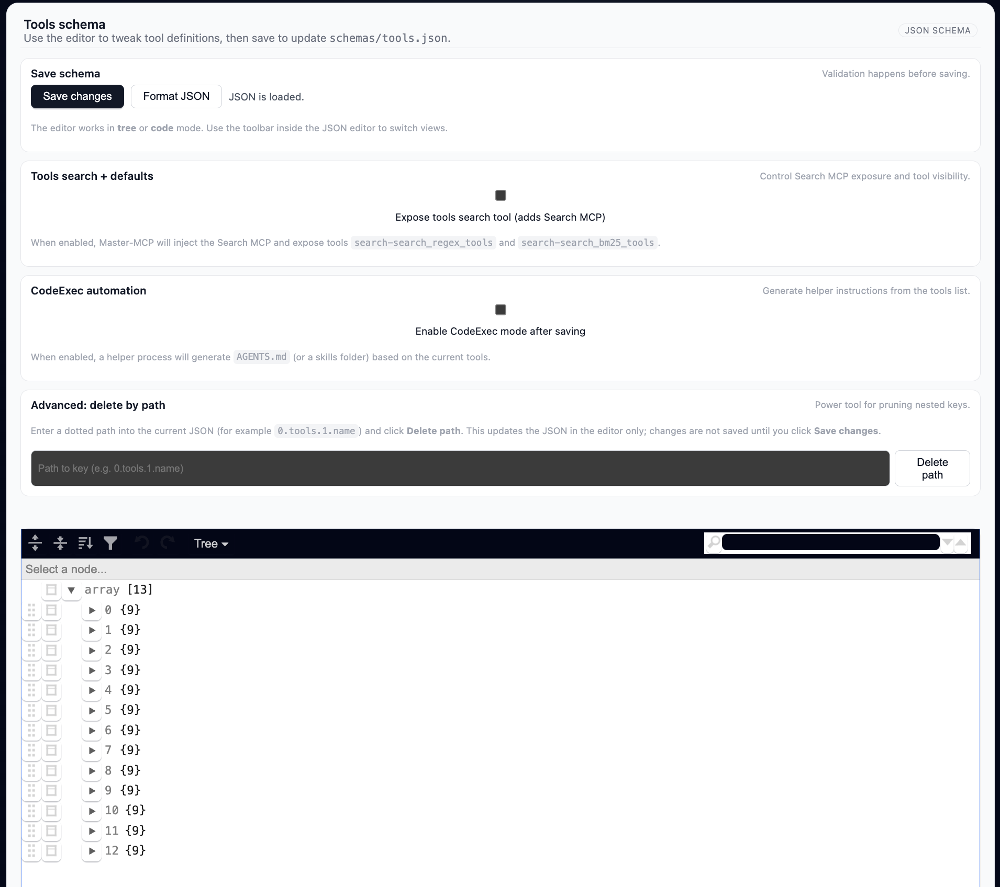
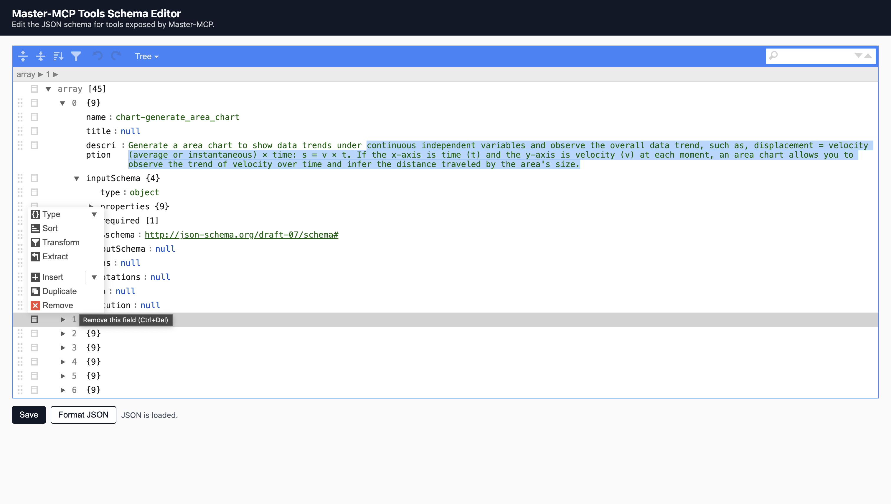

TDS Blogpost with evidence of importance [link](https://towardsdatascience.com/master-mcp-as-a-way-to-keep-mcps-useful-in-agentic-pipelines/)

## Master-MCP

Master-MCP is a **proxy MCP server** that can connect to any number of other MCP servers and expose all of their tools through a **single MCP endpoint** (stdio or remote through [mcp-proxy](https://github.com/sparfenyuk/mcp-proxy)).

You can plug Master-MCP into an agent / LLM client (e.g. Claude Desktop, Cline, custom MCP client) as if it were just one MCP server, and it will internally fan out to multiple underlying MCPs, unify their tools, and provide a small web UI to edit tool schemas.

This repository contains a minimal Python implementation of such a proxy on top of the
[`modelcontextprotocol/python-sdk`](https://github.com/modelcontextprotocol/python-sdk).

---

## Features

- 🔌 **Many MCPs → One endpoint**  
  Configure an arbitrary number of MCP servers in `mcps.json`. Master-MCP connects to all of them and re-exports their tools.

- 🧩 **Tool name namespacing**  
  Tools from each MCP are renamed to `<mcp-name>-<tool-name>` to avoid collisions and to make the origin server explicit.

- 🧱 **Centralized tool schema management**  
  Master-MCP loads all remote tools, writes their schemas into `schemas/tools.json`, and keeps a hash to detect modifications.

- ✏️ **Built‑in schema editor UI**  
  A small FastAPI + Uvicorn web app (`schema_editor.py`) is started automatically (default on port `8001`) so you can edit the tools JSON schema live in your browser: delete tools, parameters, edit the descriptions - everything to make the tool usage tailored to your business needs.

- 💻 **Switch to Code Execution Mode**
  Code Execution mode follows [Anthropic's approach](https://www.anthropic.com/engineering/code-execution-with-mcp) where MCPs provide integrations, but the tools can be inserted inside Python or TypeScript code to be used with the code execution. That can be effective for better context management and repetitive tool calling cases.

---

## Search MCP (regex + BM25)

This repo also includes an optional **Search MCP** (`search_mcp_server.py`) that
indexes a curated subset of tools and provides:

- **Regex full-text search** over tool name/description/schemas
- **BM25 ranked search** (Okapi BM25) for keyword-style queries

### Curated tool list

- `schemas/tools.json` – the default discovered tools catalog (generated by Master-MCP)
- `schemas/default_tools.json` – tools returned by `list_tools()` ("shown by default")
- `schemas/search_tools.json` – tools that are *searchable* via Search MCP

These are generated when you save settings in the schema editor UI.

You can edit `schemas/search_tools.json` to remove tools you don’t want to be searchable.

### Running

Run it as a stdio MCP:

```bash
python search_mcp_server.py
```

CodeExec mode output formatting:

```bash
MASTER_MCP_CODEEXEC=1 python search_mcp_server.py
```

- Normal mode results include: `name` (prefixed tool name), `description`, `inputSchema`
- CodeExec mode results include: `server_name`, `function_name`, `parameters`, `required`

If you enable it via a flag, Master-MCP will inject it into runtime configs and
expose its tools as:

- `search-search_regex_tools`
- `search-search_bm25_tools`

Enable flag:

```bash
MASTER_MCP_ENABLE_SEARCH_MCP=1 python master_mcp_client.py
```

(This flag is handled directly by `master_mcp_client.load_mcp_configs()`.)

### Schema editor integration

In the schema editor UI (`http://127.0.0.1:8001`) you can:

- toggle **Expose tools search tool** (persists into `schemas/ui_settings.json`)
- choose **Default tools** (comma-separated tool names)

Master-MCP will then:

- only return default tools from `list_tools()`
- inject Search MCP when enabled

---

## Code execution mode

In code execution mode a separate FastAPI. This FastAPI connects to the MasterMCP as a client. At the same time special tool execution code snippets are generated as well as AGENTS.md or CLAUDE.md - these files should be put to the AI Agent workdir. Also skills-type code execution supported.

To launch:
1. Run `python master_mcp_client.py`
2. Go to the schema editor at `localhost:8001`
3. Press checkbox at CodeExec mode, finish setup and press "Save" button - all the files should be generated in your workdir (place them to the agent's workdir)

Now your agent can call the function in code execution mode. Functions execution will happen the following way `Function->FastAPI->MasterMCP->Internal MCP`

---

## Schema editor screenshot

The schema editor is being launched at `localhost:8001`




## Architecture Overview

### High-level

There are three main parts:

1. **Master MCP client & proxy (`master_mcp_client.py`)**  
   - Connects to all configured MCP servers (via stdio) as a *client*.
   - Discovers their tools using `ClientSession.list_tools()`.
   - Renames and aggregates tools into a single registry.
   - Persists the tool schemas into `schemas/tools.json` and keeps track of a hash so changes in the editor can be trusted.
   - Implements `list_tools` and `call_tool` handlers that are exposed as a stdio MCP server.

2. **Master MCP stdio server (`master_mcp_client.py` / `server_run`)**  
   - Uses the python MCP SDK's `Server` and `mcp.server.stdio.stdio_server()` to run a standard stdio-based MCP server.
   - From an external agent/LLM perspective, this looks like a single MCP server named `Master-MCP-server` with a flat list of tools.

3. **Schema editor service (`schema_editor.py`)**  
   - A FastAPI app that serves a very simple HTML UI.
   - Reads and writes `schemas/tools.json`.
   - Lets you directly edit the JSON array of tools and saves a hash to validate integrity.

### Tool flow

1. Start Master-MCP (the stdio server).
2. It reads `mcps.json` and connects to each configured MCP using `MCPClient`.
3. For each underlying tool:
   - Its name is prefixed with the MCP key from `mcps.json` (e.g. `chart-generate_area_chart`).
   - Its input schema is optionally filtered to hide special parameters (those whose key ends with `_` and contain a `default`).
4. The full list of tools is written into `schemas/tools.json` and exposed in the schema editor UI.
5. When the agent calls a tool:
   - Master-MCP looks up the tool by the prefixed name.
   - It calls the corresponding underlying MCP tool with its original (unprefixed) name.
   - The result is returned to the agent as plain text (and can be extended to more structured responses later).

---

## Project Layout

```text
.
├── master_mcp_client.py      # Main Master-MCP client/proxy + stdio MCP server
├── master_mcp_server.py      # Placeholder / custom MCP server implementation (future extension)
├── mcps.json           # Configuration for external MCP servers
├── schema_editor.py    # FastAPI-based JSON schema editor UI
├── schemas/
│   └── tools.json      # Generated & editable tools schema
└── requirements.txt    # Python dependencies
```

---

## Installation

### 1. Create and activate a virtualenv (recommended)

```bash
python -m venv .venv
source .venv/bin/activate  # on Windows: .venv\\Scripts\\activate
```

### 2. Install dependencies

```bash
pip install -r requirements.txt
```

This pulls in:

- `mcp` – the Model Context Protocol Python SDK
- `fastapi` – for the schema editor HTTP API
- `uvicorn` – ASGI server used to serve the FastAPI app

You also need any **external MCP servers** you intend to use to be available, e.g. via `npx` as in the default `mcps.json`.

---

## Configuration

External MCP servers are configured through the `mcps.json` file at the repository root.

Example:

```json
{
  "chart": {
    "command": "npx",
    "args": ["-y", "@antv/mcp-server-chart"]
  },
  "airbnb": {
    "command": "npx",
    "args": ["-y", "@openbnb/mcp-server-airbnb"]
  },
  "echarts": {
    "command": "npx",
    "args": ["-y", "mcp-echarts"]
  }
}
```

Each top‑level key (e.g. `"chart"`) is used as a **namespace prefix** for the tools coming from that server. The object must contain:

- `command`: The executable to run (e.g. `npx`, `node`, `python`).
- `args`: A list of arguments for the command (e.g. the MCP server package name or script).

You can add as many entries as you like; Master-MCP attempts to connect to all of them on startup.

---

## Running Master-MCP

### As a stdio MCP server

Use MCP config with your agent (use path to master_mcp_client.py if not in the root):
```json
{
  "master-mcp": {
        "command": "python",
        "args": ["master_mcp_client.py"]
  }
}
```

Equivalent to:
```bash
python master_mcp_client.py
```

This will:

1. Read `mcps.json` and spin up a `MCPClient` for each configured server.
2. Discover all tools from those MCPs.
3. Aggregate, rename, and save tool schemas into `schemas/tools.json`.
4. Ensure the schema editor service is running on port `8001`.
5. Start the stdio MCP server `Master-MCP-server` over stdin/stdout.

You can now point any MCP-aware agent at this server using stdio transport.

> Note: `master_mcp_server.py` is a placeholder entry for a custom / dedicated MCP server implementation; the current working entry point for the proxy is `master_mcp_client.py`.

### Using HTTP transport through [mcp-proxy](https://github.com/sparfenyuk/mcp-proxy)

```
npx mcp-proxy \
  --port 3333 \
  python master_mcp_client.py
```

---

## Using the schema editor

When `master_mcp_client.py` starts, it calls `_ensure_editor(8001)` which:

- Checks whether something is already listening on `127.0.0.1:8001`.
- If not, starts a `uvicorn` process running `schema_editor:app`.

Then open the editor in your browser:

```bash
open http://127.0.0.1:8001/
```

You’ll see a single textarea containing the `modified` array of tool schemas from `schemas/tools.json`. You can:

- Edit descriptions, titles, or other metadata.
- Add or remove tools, or tweak input schemas.
- Click **Save** to persist the changes. A hash of the modified schema is also saved.

On the next `list_tools` call, Master-MCP will reload the schema from this file (if the hash matches), so your edits become the canonical tool definitions exposed to the agent.

---

## Development notes

- **Tool parameter hiding**  
  `MasterMCP._hide_tools_params` strips out parameters whose name ends with `_` and whose schema contains a `default` field. These are treated as internal / implementation details and not exposed to the agent.

- **Extending call behaviour**  
  Currently `call_tool` returns the first text content as `{ "result": "..." }`. You can extend this to return structured content (e.g. `structuredContent`) or to perform additional processing / logging / routing.

- **Adding more MCPs**  
  Simply extend `mcps.json` with additional entries. If you use local scripts instead of `npx`, point `command` to `python` or `node` and specify the script path in `args`.

- **UI, security, preprocessing**  
  The header comment in `master_mcp_client.py` describes future enhancements:
  - Rich UI around prompts and tool selection
  - Security controls (auth, rate limits, manual approval, etc.)
  - Pre/post-processing hooks for tool invocations

These are not fully implemented yet, but the architecture is oriented around the MasterMCP class so they can be layered on without changing the external MCP interface.

---

## Roadmap / Ideas

- Code execution mode (with different languages integration)
- Visual UI to enable/disable tools and MCPs at runtime
- Advanced security model (user roles, sandboxing, explicit confirmations)
- Optional HTTP/WebSocket transport in addition to stdio
- Monitoring tools
- Tools heirarchy mechanics
- Tools orchestration
- Add Skills and prompts (just a prompt with no tool execution)

---

## 🤝 Contribute & Collaborate

If you're interested in contributing, testing new detection methods, or exploring related projects, feel free to contribute and reach me out — collaboration is welcome!

📩 Contact: marvinromson@gmail.com
and [LinkedIn](https://www.linkedin.com/in/roman-smirnov-09165b127/)

---

## ❤️ Support

If you find this project helpful or use it in your research, you can support further development:  
📩 Contact: marvinromson@gmail.com

